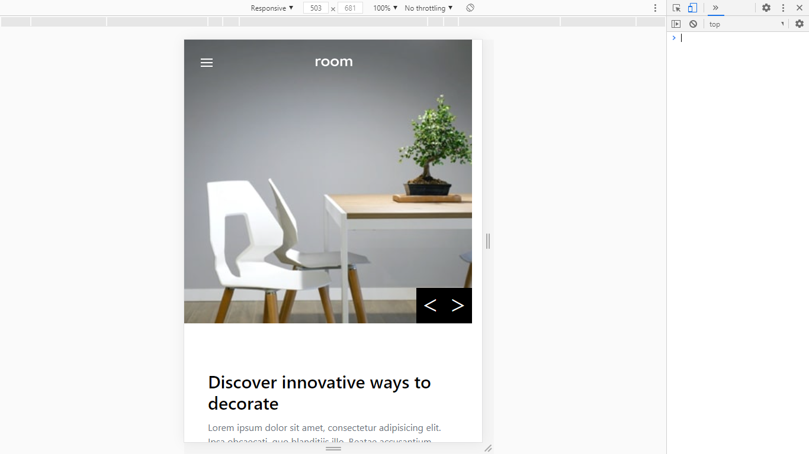

This is a Front Mentor UI challenge. It is to show my design skills and my proficiency with Vue and Vue CLI.

It contains no backend.

The Stacks used are:

- VueJs
- HTML
- TailwindCss

#Pictures 

